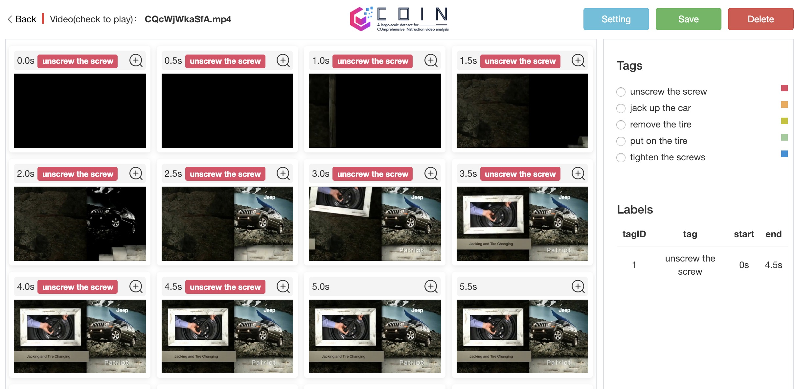
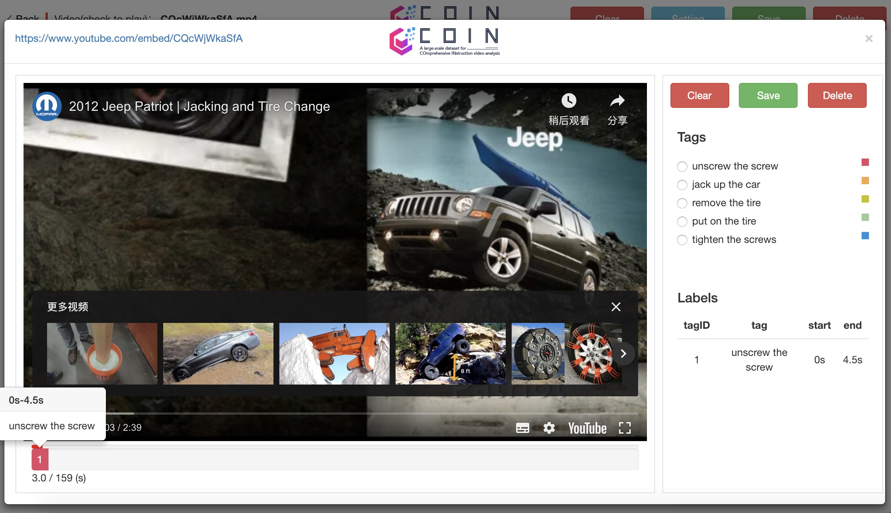

# Annotation Tool Usage

## Documents

```
.
├── input (Input files)
├──── video (Extrated frames)
├────── URLID
├──────── frame (Check example)
├──── frame.txt (URLID,Frame,Time)
├──── label.txt (TagID,Tag)
├──── video.txt (URLID,URL)
├── lib (Source code)
└── coin_annotation_tool.html (Click to label)
```

## Usage


### Load Files 


> 1. Click `coin_annotation_tool.html`

> 2. Click `Load video file`, `Load label file`, `Load frame file` to load `video.txt` ,`label.txt`, `frame.txt`

> 3. Click `Load` to load files

---

### Start Labeling

#### Frame Mode



> Operations

1. `Setting`: Set `Row` and `Interval`

2. `Save`: Save current results

3. `Delete`: Delete current video

> Usage

1. Select images by clicking start and end frame

2. Click and select `Tags`

3. Clear labeled results by `Clear`

---

#### Video Mode



> Operations

1. `Save`: Save current results

2. `Delete`: Delete current video

> Usage

1. Click video name on the top to enter video mode

2. Click the bar at the bottom, select start and end frame

3. Click and select `Tags`

4. Clear labeled results by `Clear`

---

### Download results

Click `Download` to download results 
